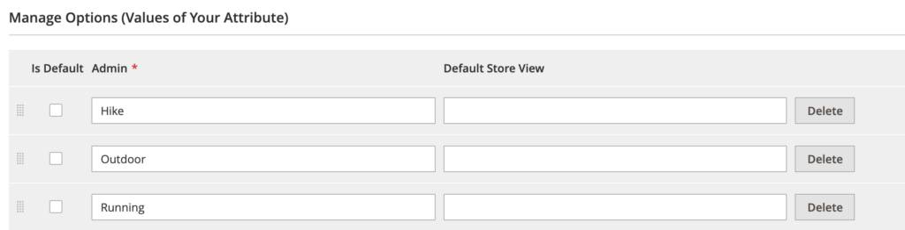

### Product attributes

In Adobe Commerce, attributes are used for any data point related to a particular entity. Product attributes identify data points used for a long list of things. An attribute could show on a product page, be used for configurable variations, be for admin use only, for customizations, and many more. When a custom module is installed that relates to products, you will likely see attributes installed for use by the module.

Attribute codes must contain only lowercase letters and numbers and must start with a letter. This code is the golden record for the attribute and will be used for imports and integrations with the product data.

When setting up attributes, it is important to set them up correctly for their specific purpose. There are some configurations that can be updated after creation, but others that cannot. Below are some of the questions you should consider.

* Will they be used in an integration or for data transfer to/from another system?
* Will the attribute be visible on the front end? If yes, where?
* Will the attribute be used for a configurable variation?
* Are there multiple websites, stores or store views to account for?

Remember that it is best practice to create attributes at the highest appropriate scope. Also, keep in mind that drop-down type attribute values are translatable—you do not need to create a new value or attribute for each store view.

**Further reading:**
* [Product Attributes](https://docs.magento.com/user-guide/stores/attributes-product.html)
