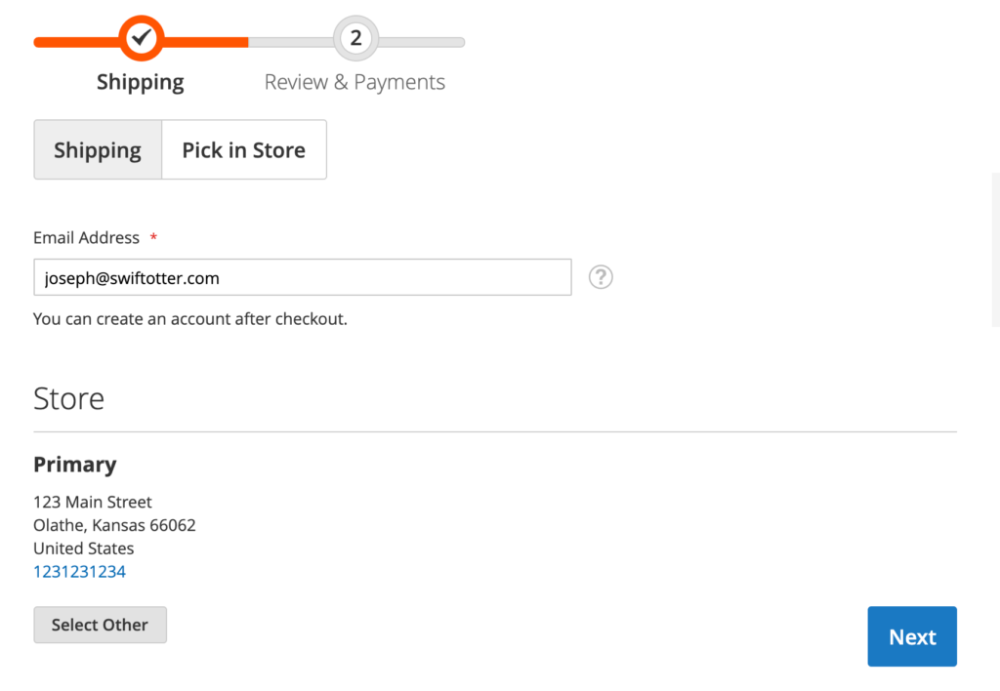

### In Store Pick Up

New in 2.4 is the ability to use a set up stock location for store pickup. If the source is configured to allow pick ups and your configuration is set up in Sales > Delivery Methods, a customer whose cart items are in stock at the location within their area, will see the option in checkout.

* You need to enable the In-Store Pickup Method.
* Each applicable source also needs to be available for In-Store Pickup.
* Step 1 of the checkout: the customer can select In-Store Pickup (see picture below).
* Once the order is placed, the Administrator can click "Notify Order is Ready for Pickup". This will trigger an email to the customer. Shipping this order is not an action that is available. Once the order is invoiced, stock is decremented.

**Further reading:**

* [In-store Delivery](https://docs.magento.com/user-guide/shipping/shipping-in-store-delivery.html)
