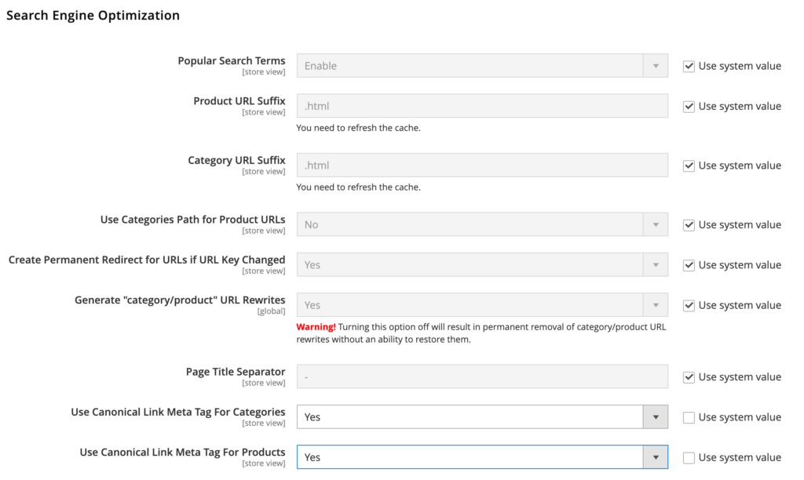

### The “all-important” canonical link element

The canonical link element is an HTML meta tag that resides in the HTML source (right-click on a page and click View Source).

In Adobe Commerce (Magento), there are pages that can show the same content as other pages. The best example is a product page (from the Magento Luma store):

* `/gear/bags/push-it-messenger-bag`
* `/push-it-messenger-bag`
* `/catalog/product/view/id/14`

If Google has knowledge of each of these links (#1 and #2 are the biggest problems), it might not know which items to show to visitors. You might have search engine results pointing to the #1 scheme and others pointing to the #2 scheme.

The canonical URL resides in the head tag:

```
<pre class="wp-block-code<code>&lt;link rel="canonical" href="https://super-fancy-store.com/joust-duffle-bag.html" /></code></pre>
```

This tells Google that the canonical (authoritative) reference to this page is the `href` link. To enable it, go to Store Configuration > Catalog > Search Engine Optimization > Use Canonical Link Meta Tag For Products and Use Canonical Link Meta Tag For Categories.



Note that this feature is quite basic for products. By default, Adobe Commerce (Magento) only links to the product in the website root URL and not the category > product path.
