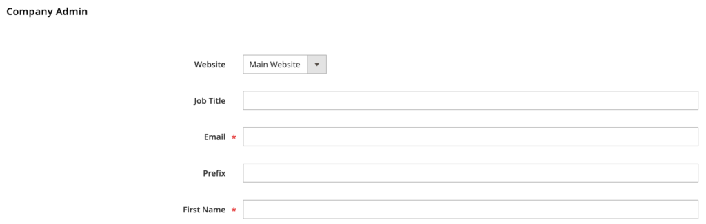

### Manage company accounts

A key component of B2B is treating companies as a separate entity from a customer. A customer can be linked to a single company, which is linked to a single shared catalog.

You will find company accounts in Customers > Companies.

In the company screen, you can set up all the normal fields (address, tax ID, comments, who is the point of contact, etc.). You can also configure their available payment terms and see how much they have spent against that. Once the company utilizes payment on account, this is also where an admin will credit the account for payments received.

You can configure their shared catalog from Catalog > Shared Catalog (see following section). This is how you assign the specific catalog of products to members of a company.

Finally, you can configure if they can have quotes and which payment and shipping methods can be used.

When a company signs up on the frontend (this permission can be disabled), they go into the Pending Approval status. An administrator must move these companies into the Approved status for them to begin purchasing. Once the company is approved, the primary contact receives an email notifying them of the update.

One confusing aspect of managing a company is the Company Admin fields:

It's confusing because these attributes come directly from the customer administration panel. If your developers create a modification to the customer's uiComponents, they also will want to make the change here, too.

**Further reading:**

* [Company Accounts](https://docs.magento.com/user-guide/customers/account-companies.html)
