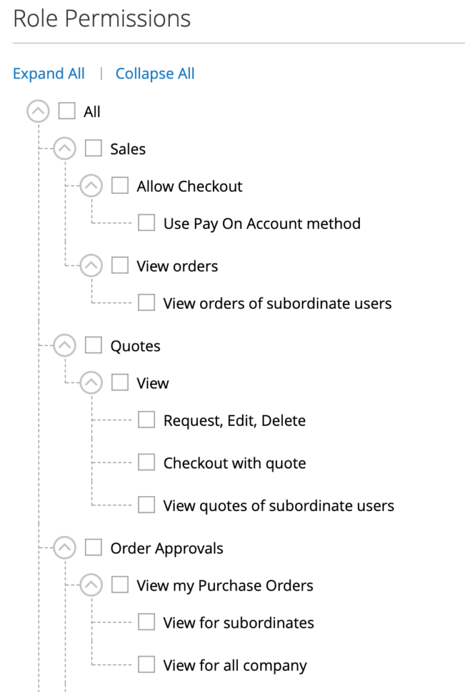
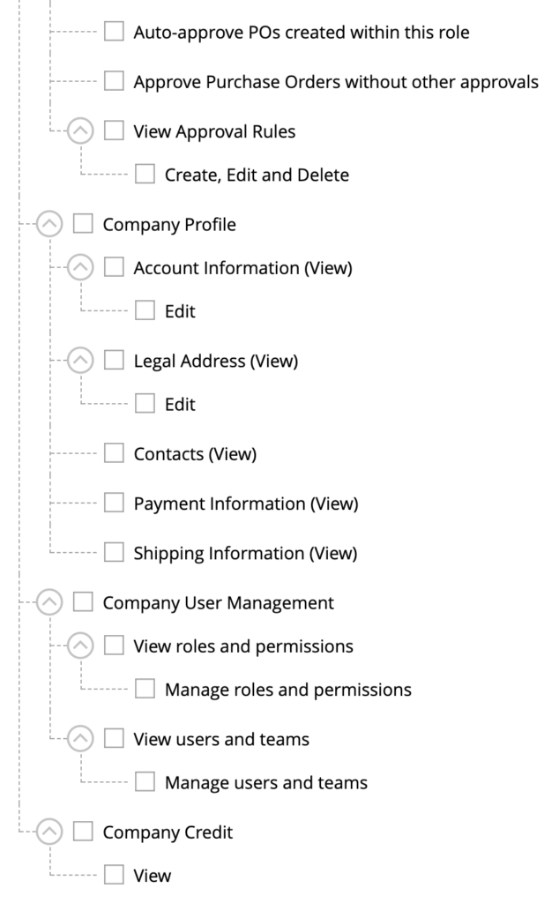

### Company account permissions / frontend

If allowed, anyone can create a company account. The visitor specifies initial information and can submit the application.

If the visitor already has a user account, that account will be assigned as the primary contact. Otherwise, Magento will create a new customer, who will receive an email to set a password.

Once in the company account, the new manager can:

* edit their company information
* create new users
* assign a company hierarchy tree
* create and assign permissions for company users
* Create approval rules for company users

In addition to having visibility into the company’s full history across users, it allows the procurement manager for a company to have great powers over how the website is utilized by company users.

|    |  |
|-----|-----|

**Further reading:**

* [Company Structure](https://docs.magento.com/user-guide/customers/account-company-structure.html)
